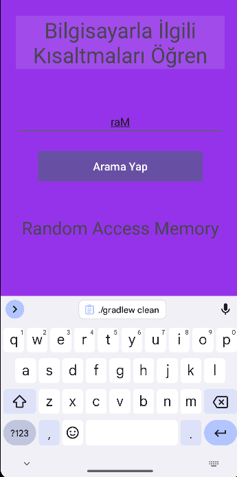

# Proje Adı

Bu projede Android Studio ile Firebase kullanarak bilgisayar bileşenlerinin kısaltmalarını ve açıklamalarını görüntüleyen bir uygulama geliştirilmiştir.

## Uygulama Arayüzü

Aşağıdaki fotoğraf, uygulamayıgöstermektedir:

## Kullanım

- Firebase veritabanındaki kısaltmalar ile bilgisayar bileşenlerinin açıklamaları sorgulanabilir.
